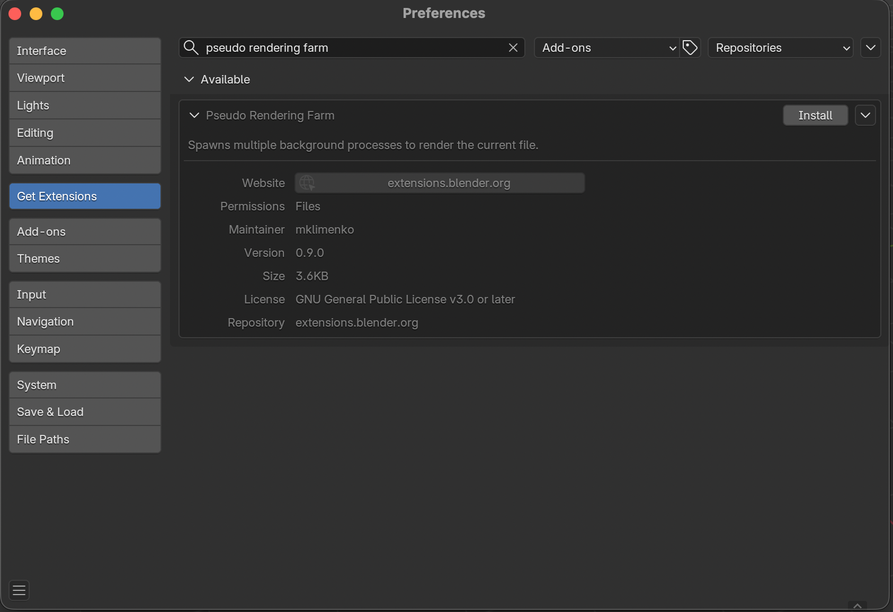
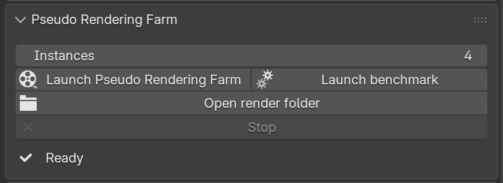

# Pseudo rendering farm for Blender

A small script to leverage parallel rendering in Blender on a single machine

> [!NOTE]
> This is not a one-size-fits-all kind of solution. It works when the render submission overhead is comparable to the cost of rendering a single frame, which is especially true for EEVEE and simpler frames. In case of Cycles, single scene or a lot of stuff to process, a regular rendering farm (like [Flamenco](https://flamenco.blender.org/)) might be a better fit.

- [Pseudo rendering farm for Blender](#pseudo-rendering-farm-for-blender)
  - [Installation](#installation)
  - [Usage](#usage)
  - [Description](#description)
  - [Results](#results)

## Installation

There are two ways to install this extension. The first option uses the built-in Blender functionality to locate and install the extensions. All you need to do is search for “Pseudo Rendering Farm” in Edit -> Preferences -> Get Extensions. This will also allow you to automatically install updates.

Another way is to download the latest release from the [panel on the right](https://github.com/MKlimenko/PseudoRenderingFarm/releases) and install it by navigating to Edit -> Preferences -> Add-ons -> Install from Disk… (located at the top right of the window).

## Usage

After you've installed the Add-On, there is one prerequisite before starting to use it. By default, Blender sets the Output image sequence properties of `Overwrite` checked and `Placeholders` unchecked. This is useful for a regular render, but contradicts with the goals of this Add-On. In order for this plugin to work you need to uncheck `Overwrite` and check `Placeholders`. This allows individual instances to "claim" a specific file to work and forbids adjacent instances to work on the same file. There is a built-in check that'd let you know if you forgot to do that.

After the installation you'd see the following user interface in the Render plane with the main controls:

## Description

To render each frame, Blender prepares the necessary data, sends it to the GPU and triggers the computations. With modern hardware and simple enough scene, the overhead of preparation might be similar or even exceeding the time it takes to produce a frame.

This plugin solves it by launching several background Blender instances in parallel. By using frame placeholders and disabling overwrite, each instance claims the frame and starts working on it independently.

The result is faster rendering due to better hardware utilization. On the left hand side you can see that the renders are separated by an amount of time equal to the render itself. At the same time, spawning multiple instances improves the situation significantly, at the expense of spending more system RAM and VRAM.

| Before                    | After                   |
|---------------------------|-------------------------|
|  |  |

There's a built-in benchmark that tests the first 50 frames of the scene to give an estimation of the number of instances to use. Bear in mind, that the first 50 frames might not be fully representative and you might need to adjust it to be either bigger or smaller.

## Results

With a default cube scene, as simple as it gets, we can get a minor increase of ~20% on a lower-grade machines (Mac Mini M1) and a significant improvement of up to 2x using a machine with a powerful GPU (NVIDIA 4070 Super). Below is a comparison based on 100 rendered frames.

| Device \ Instance count  | 1      | 2      | 3       | 4      |
|--------------------------|--------|--------|---------|--------|
| Mac Mini M1 (8GB)        | 119 s  | 98 s   | 100.7 s | 127 s  |
| NVIDIA 4070 Super (12GB) | 30.6 s | 25.1 s | 16.8 s  | 17.1 s |

The same principle can be also applied for an animated series. Below are the collected numbers for an episode of [Funny Legs](https://www.youtube.com/watch?v=pM53SfAU2y8&list=PLsdnreF82vL400pWANHv3mRVyBop28bTb), a 2D show made in 3D in Blender (check out the [BCon 2025 talk](https://youtu.be/FLb-ow21gB0)!). Below are the measurements to render the whole episode of 810 frames.

| Device \ Instance count  | 1       | 2       | 3       | 4       |
|--------------------------|---------|---------|---------|---------|
| Mac Mini M1 (8GB)        | 24m41s  | 18m27s  | 21m27s  | 26m21s  |
| NVIDIA 4070 Super (12GB) | 6m53s   | 4m25s   | 3m15s   | 2m52s   |
| NVIDIA 4090 (24GB)       | 4m49s   | 2m41s   | 2m16s   | 1m59s   |
| Intel Arc Pro B70 (32GB) | 8m48s   | 5m57s   | 4m07s   | 3m50s   |
